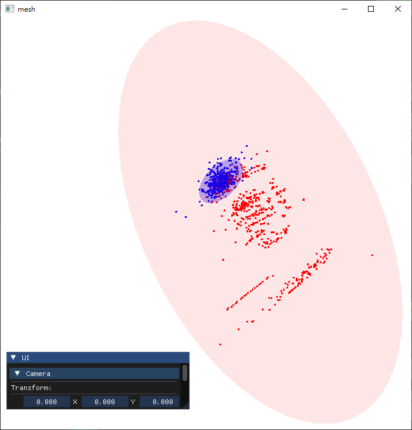

# 2D 流場視覺化與橢圓張量分析系統

這是一個基於 **OpenGL 3.3** 開發的高階流場可視化工具。本專案結合了資料科學中的 **PCA (主成分分析)** 與電腦圖學中的 **幾何著色器 (Geometry Shader)** 技術，能夠將複雜的 2D 向量場數據轉化為具備物理特徵意義的動態流線與結構化橢圓張量圖。 

## 核心技術亮點

### 1. 橢圓張量視覺化 (Ellipse Tensor Visualization)
* **特徵映射**：利用 `ellipse_geometry.gs` 幾何著色器，將網格點上的張量數據動態生成橢圓幾何。
* **形態參數控制**：橢圓的長短軸比例、旋轉角度與縮放大小均與流場的局部特徵（如應力或方向性）掛鉤。
* **著色邏輯**：透過 `ellipse_fram.fs` 處理橢圓內部的色彩填充，協助觀察流場的各向異性（Anisotropy）。

### 2. 進階流線追蹤 (Streamline Integration)
* **數值積分**：實作了流場軌跡追蹤邏輯，透過 `geometry.gs` 將抽象的線段擴展為具備寬度變化的帶狀矩形（Triangle Strips）。
* **流速映射**：
    * **顏色**：根據流速大小從 1D 傳遞函數紋理（Transfer Function）中採樣色彩。
    * **粗細**：流線寬度可隨粒子運動進度或流速動態調整。

## 操作指南

### 1. 攝影機與導覽
* **X / Y / Z**: 調整觀察位置與縮放。
* **Pitch / Yaw / Roll**: 旋轉視角以觀察數據在不同座標系下的表現。
* **Reset**: 快速恢復至預設觀察狀態。

## 開發環境
* **語言**: C++
* **圖形庫**: OpenGL 3.3 Core Profile (GLAD / GLFW / GLSL)
* **數學庫**: GLM & PCA
* **UI 庫**: Dear ImGui
