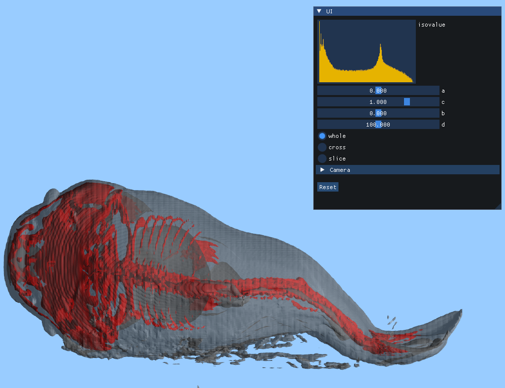
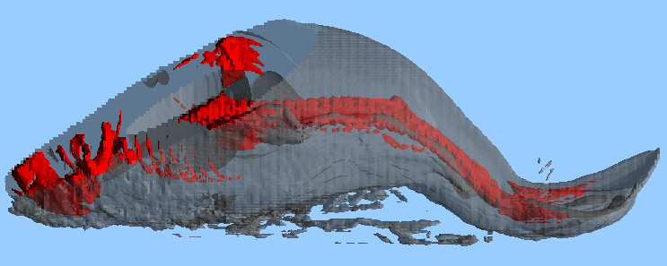
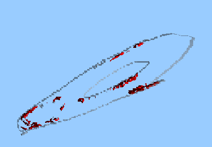

# Marching Cubes 體積渲染器 (Static Multi-Layer Volume Renderer)

這是一個基於 **OpenGL 3.3** 核心配置開發的體積資料視覺化系統。本專案實作了經典的 **Marching Cubes 演算法**，能將 3D 的 `.raw` 原始二進位數據轉換為三角面網格，並支援多層等值面（Iso-surfaces）的同步渲染與互動式平面裁切。

## 核心技術亮點

### 1. Marching Cubes 演算法實作
* **網格提取**：針對 $256^3$ 的資料單元進行掃描，透過 `edgeTable` 與 `triTable` 快速查找三角面生成配置。
* **線性插值**：利用 `VertexInterp` 精確計算等值面穿過網格邊緣的交點，確保模型表面的平滑度。

### 2. 多層渲染與透明度管理
* **靜態預處理**：程式啟動時會根據預設等值（如 30 與 200）預先計算所有網格數據，並快取於 VBO 中以提升繪圖效能。
* **渲染順序優化**：系統採用特定的繪製順序，先繪製不透明層（Alpha=1.0，如骨骼），再疊加半透明層（Alpha=0.5，如皮膚），以呈現正確的空間層次感。

### 3. 動態裁切系統 (Shader-based Clipping)
透過 Vertex Shader 中的平面方程式 $ax + by + cz + D = 0$ 實作即時裁切：
* **Whole**: 顯示完整物件。 
  
* **Cross**: 裁切平面一側的網格，顯示內部構造。 
  
* **Slice**: 僅顯示平面附近的薄層網格，模擬醫學影像的切片效果。 
  

### 4. 視覺效果
* **Phong Lighting Model**: 在 Fragment Shader 實作環境光、漫反射與鏡面反射，強化物體的體積感。
* **數據直方圖**: 利用 Dear ImGui 呈現資料分布的對數直方圖，協助使用者精確選擇等值面數值。

## 操作指南

### 攝影機控制 (Camera)
* **X / Y / Z 滑動條**: 控制攝影機在世界座標中的位置平移。
* **Pitch / Yaw / Roll**: 調整攝影機的觀察角度。
* **Reset**: 一鍵重設攝影機與視角矩陣。

### 裁切平面控制 (Clipping Controls)
* **a / c / b 滑桿**: 調整平面法向量的方向。
* **d 滑桿**: 調整平面與原點的偏移距離 $D$。
* **Mode 選擇**: 切換 Whole (0), Cross (1), Slice (2) 顯示模式。

## 開發環境
* **語言**: C++
* **圖形庫**: OpenGL 3.3 Core Profile (GLAD / GLFW)
* **數學庫**: GLM
* **UI 庫**: Dear ImGui
* **支援格式**: 8-bit 無符號整數原始體積數據 (.raw)
