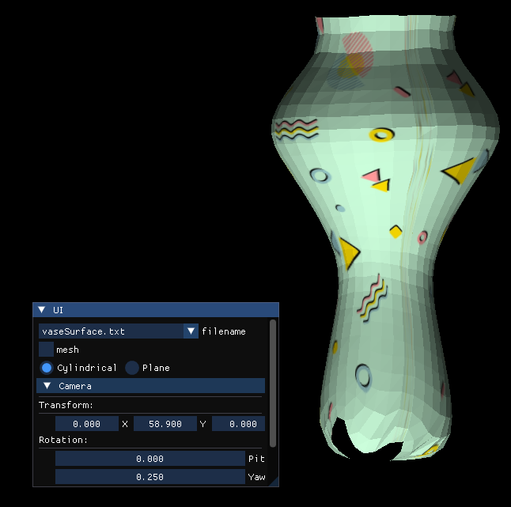
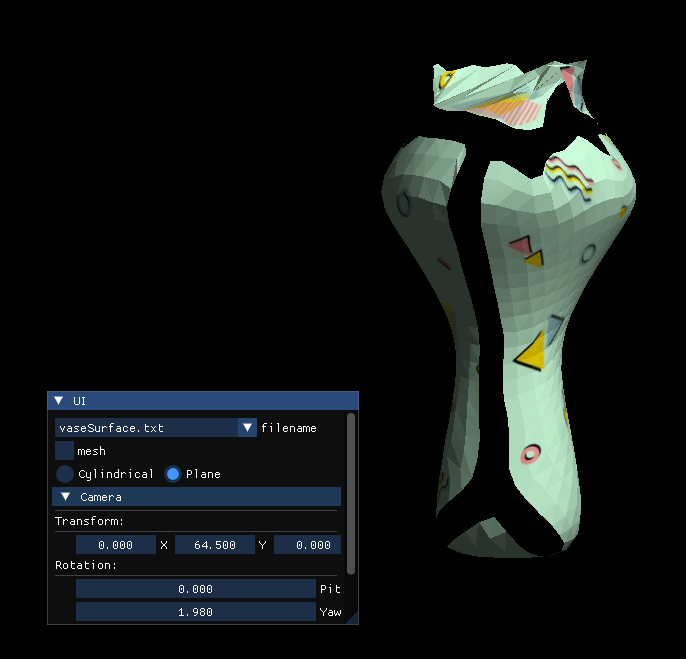

# SOM 3D 表面擬合器 (Self-Organizing Map Surface Fitter)

這是一個基於 **OpenGL 3.3 Core Profile** 開發的 3D 表面重建系統。本專案利用 **自組織映射演算法 (Self-Organizing Map, SOM)**，將無序的 3D 點雲數據（如花瓶、兔子或茶壺表面）訓練並映射至一個 2D 網格拓撲上，實現平滑且具連續性的表面擬合。

## 核心技術亮點

### 1. SOM 演算法與流形擬合
* **動態權重更新**：從原始 `.txt` 點雲中隨機選取樣本，尋找最接近的神經元（BMU），並透過鄰域函數同步調整周邊節點。
* **參數指數衰減**：實作了學習率（Learning Rate）與鄰域半徑（Distance Range）的隨退火策略，確保模型從初期的全局形變平滑過度到後期的局部細節擬合。
* **多種拓撲支援**：
    * **Cylindrical Mode**: 針對具環狀特徵的物體，實作了邊界銜接邏輯（第 1 欄與第 32 欄互為鄰居）。 
      
    * **Plane Mode**: 標準的四邊形網格，適用於一般曲面重建。 
      

### 2. 高效能渲染管線
* **動態 VBO 更新**：訓練過程中，系統會定期將最新的 SOM 權重（作為頂點座標）重新匯入 VBO，實現即時的擬合過程預覽。
* **自動法向量計算**：透過 `gradient` 函式即時計算相鄰節點構成的三角面法向量，確保光影效果隨模型形變正確更新。
* **雙重繪製模式**：
    * **Mesh Mode**: 使用 `GL_LINES` 繪製拓撲骨架，觀察神經元的演化過程。
    * **Solid Mode**: 使用 `GL_TRIANGLES` 並搭配自定義頂點法向量進行著色。

### 3. 進階著色器實作 (GLSL)
* **Phong Lighting Model**: 在 Fragment Shader 中整合環境光 (Ambient)、漫反射 (Diffuse) 與鏡面反射 (Specular)，強化擬合表面的體積感與平滑度。
* **Texture Mapping**: 支援將 `.jpg` 影像透過 UV 座標映射至訓練完成的網格上，增加視覺細節。

### 4. 互動式 UI 系統
整合 **Dear ImGui** 提供直覺的操作介面：
* **模型管理**：可隨時切換點雲文件並一鍵重置（Reset）訓練狀態與攝影機。
* **相機系統**：實作了基於相機座標系（U-V-N 矩陣）的 6 自由度控制，支援 Pitch、Yaw、Roll 旋轉。

## 視覺效果

* **Wireframe**: 展現 32x32 格點的拓撲結構。
* **Phong Shading**: 呈現平滑的高光與陰影分布。
* **Cylindrical Mapping**: 處理封閉式幾何體的擬合。

## 操作指南

### 1. 訓練與模型控制 (Training)
* **Filename**: 從下拉選單選擇擬合目標（如 `vaseSurface.txt`）。
* **Mesh Checkbox**: 切換顯示「拓撲線框」或「實體著色面」。
* **Mode Select**: 根據目標物體形狀選擇 Cylindrical 或 Plane。

### 2. 攝影機導航 (Camera)
* **Transform (X/Y/Z)**: 控制攝影機在世界空間中的平移。
* **Rotation**: 調整視角的俯仰 (Pitch)、偏航 (Yaw) 與翻滾 (Roll)。
* **Reset Camera**: 快速重設視角矩陣與座標。

## 開發環境
* **語言**: C++
* **圖形庫**: OpenGL 3.3 Core Profile (GLAD / GLFW)
* **數學庫**: GLM
* **UI 庫**: Dear ImGui
