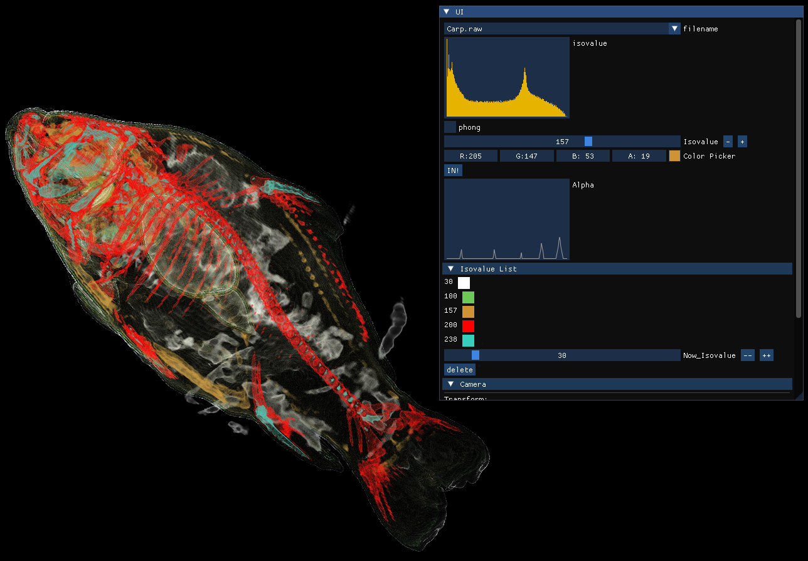
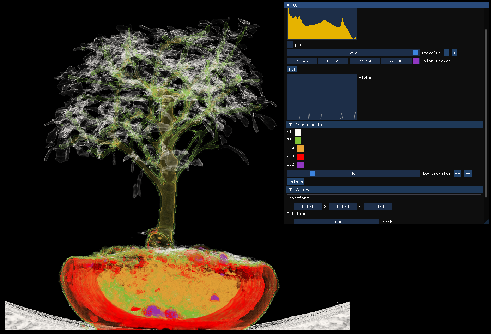

# 3D 體積渲染器 (Ray Casting Volume Renderer)

這是一個基於 **OpenGL 3.3** 開發的即時體積渲染系統。本專案採用 **Ray Casting (光線投射法)** 技術，直接對 3D 體積資料（`.raw` 格式）進行採樣與著色，而非轉化為傳統網格。系統支援自定義傳遞函數（Transfer Function）與動態光照計算。 
 

## 核心技術亮點

### 1. Ray Casting 演算法實作
* **光線步進 (Ray Stepping)**：在 Fragment Shader (`fram.fs`) 中，從進入點沿著觀察視角射出光線，以 `0.15f` 的步長穿過體積數據。
* **合成運算 (Compositing)**：利用正向合成（Front-to-Back）公式計算顏色與不透明度（Opacity），當不透明度飽和（> 0.99）或超出邊界時自動停止採樣以優化效能。

### 2. 數據與紋理管理
* **3D 紋理映射**：將 `.raw` 資料與預先計算的**梯度 (Gradient)** 整合進 `GL_TEXTURE_3D`，R/G/B 頻道存儲法向量資訊，A 頻道存儲純量值（Scalar Value）。
* **1D 傳遞函數 (Transfer Function)**：使用 `GL_TEXTURE_1D` 定義不同純量值對應的顏色與透明度，實作等值面（Isosurface）的視覺化。

### 3. 進階視覺與互動功能
* **Phong Shading**：支援動態光照切換。當開啟 Phong 模式時，系統會利用預計算的梯度資訊作為法向量，計算環境光、漫反射與鏡面反射。
* **等值面管理**：可動態新增（IN!）或刪除多組等值面，並即時預覽其透明度曲線。
* **數據直方圖**：透過對數縮放（log10）呈現資料分布，輔助使用者尋找具備物理意義的數值區間。

## 控制指南

### 1. 數據與顯示
* **filename**: 切換不同的測試數據集（如 Carp, foot, skull, bonsai 等）。
* **phong**: 勾選以開啟基於梯度的 Phong 著色效果。
* **Isovalue & Color**: 手動設定特定數值的顏色與 Alpha，點擊 **IN!** 套用。

### 2. 攝影機控制 (Camera)
* **X / Y / Z**: 沿著相機座標系軸向平移。
* **Pitch / Yaw / Roll**: 旋轉觀察視角。
* **Reset**: 恢復所有設定至初始狀態。

## 運作原理說明

### 梯度計算 (Central Difference)
程式在讀取檔案時，會針對每個體素（Voxel）計算其相鄰點的差分以求得梯度向量：
- 邊界處採用前向/後向差分。
- 內部採用中心差分：`dxyz.x = (integerData[i+1][j][k] - integerData[i-1][j][k]) / 2`。

這些梯度資訊被正規化並存入 3D 紋理，作為 Shader 中光照計算所需的表面法向量（Normal）。

## 開發環境
* **語言**: C++
* **圖形庫**: OpenGL 3.3 Core Profile (GLAD / GLFW)
* **數學庫**: GLM
* **UI 庫**: Dear ImGui
* **支援格式**: 8-bit 無符號整數原始體積數據 (.raw)
